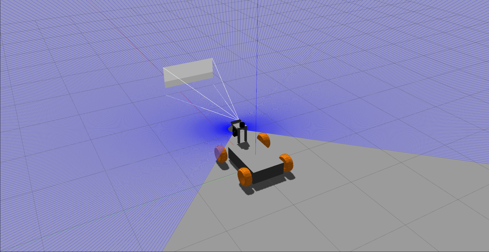
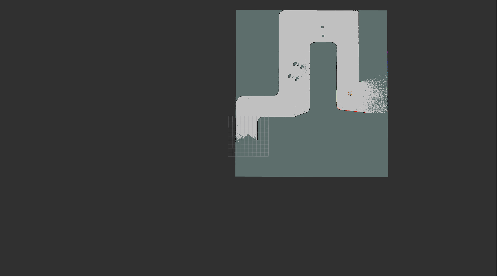

# Buggy Project

This repository states a developed project in ROS2 using Foxy and Ubuntu 20 which uses different sensors to carry out specific tasks. These tasks are mapping, object detection and navigation. 

# Requirements

- UBUNTU 20
- Foxy version
- python v3
- GAZEBO
- Specific packages from ROS 2:
   - Joint State Publisher
   - SLAM Toolbox
   - Nav2
   - TEB local planner
 For install the packages you must go directly to the root of your workspace and copy the next commands
```bash
 sudo apt install ros-foxy-gazebo-ros-pkgs
 sudo apt install ros-foxy-joint-state-publisher-gui
 sudo apt install ros-foxy-xacro
 sudo apt install ros-foxy-slam-toolbox
 sudo apt install ros-foxy-navigation2
 sudo apt install ros-foxy-nav2-bringup
```
Some packages are installed from source in your folder (work_space_name)\src and do not forget install the dependencies.
```bash
 $ cd <colcon_workspace>/src # Access the source folder of your colcon workspace
 $ git clone -b foxy-devel https://github.com/rst-tu-dortmund/teb_local_planner.git
 $ cd ..
 $ sudo rosdep init
 $ rosdep update
 $ rosdep install --from-paths src -y --ignore-src
```
To use the real sensors, some drivers have to be installed. In this project a sick Lidar, a zed2 camera and a velodyne Lidar are used. For this reason the next packages must be installed. These packages are installed also in the src folder.

### ZED2 camera
```bash
$ cd <colcon_workspace>/src # Access the source folder of your colcon workspace
$ git clone https://github.com/ros-perception/image_common.git --branch 3.0.0 --single-branch # clone the "v3.0.0" branch of the "image_common" repository
$ git clone  --recursive https://github.com/stereolabs/zed-ros2-wrapper.git
$ cd ..
$ rosdep install --from-paths src --ignore-src -r -y
$ colcon build --symlink-install --cmake-args=-DCMAKE_BUILD_TYPE=Release
```
### Sick Lidar
[Link to Portfolio Website](https://github.com/SICKAG/sick_scan_xd)
# Content
The project is divided in two stages:
- Simulated stage
- Real stage

Each stage carry out the same functionalities:
- [Mapping](#Mapping)
- [Object detection](#Object-detection)
- [Navigation](#Navigation)


## Simulated Stage

The simulation stage contains a simulated model of the real buggy. Is it importante to consider the measurements of each joint and the location of each sensor. The next picture shows the measured distances taken from the real one. 

 

### MODEL AND ENVIRONMENT
Using these measurements, the model of the buggy is made with the Universal Robot Description Format (URDF), the standard ROS format for robot modeling. The body of the buggy is integrated of links and joints. Links are the chassis, wheels, sensors, frame and joints connects the links together. To visualise the model, RVIZ is a good tool which offers different options the track different parameters. The next picture shows the buggy in RVIZ.

Launch:

```bash
ros2 launch buggy_mobile_robot buggy_simulated_description.launch.py
```
 

To place the buggy in a simulated enviroment, using GAZEBO, it is fundamental to create a Simulated Description Format (SDF) file. This file should be similar to the URDF. In the SDF file is possible to add the plugins of the sensors (camera, IMU, LiDAR).

Launch:

```bash
ros2 launch buggy_mobile_robot buggy_simulated_gazebo.launch.py
```
 

As a SDF file is used to define what a robot looks like, a SDF file to define the robot's environment is necessary to test the algorithms. The scenario is a copy of the Eupen race track.

 

### Mapping
For mapping, the slam_toolbox package from ROS2 is used. Using the concept of Simultaneous and Localization Mapping (SLAM) is possible to create a map. However the node in ROS2 requires some input topics; these are /odom and /scan. To get the odometry of the buggy two propioceptive sensors, the enconders of the wheels and the Inertial Measurement Unit (IMU), are taken in consideration. A LiDAR sensor is implemented to obtain the data to be published on the topic /scan.


```bash
ros2 launch buggy_mobile_robot buggy_simulated_mapping.launch.py
```

 


### Object detection

In this section, the concept of convolution neural networks is applied. YOLOV3 is a CNN which integrates several layers to classify different kind of objects, therefore the selection of YOLOV3 was made to detect a varity of objects (pediastrans, cars, traffic lights, signs, etc). Running the buggy on the track different objects were classified. The next picture presents the obtained results.

 

### Navigation

The use of Nav 2 in combination with Time Elastic Band(TEB) planner for navigation and control of the buggy.

 
 
